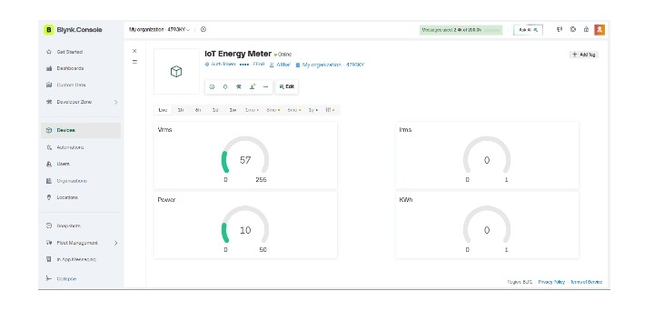
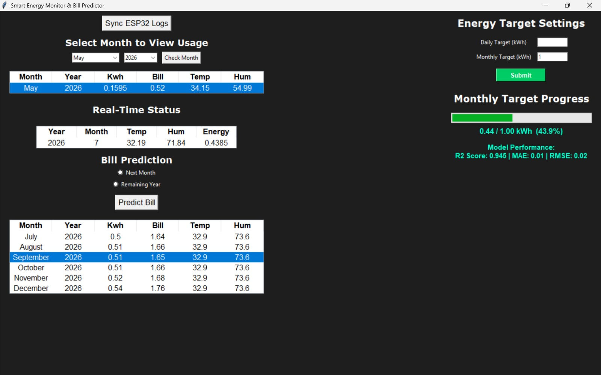

SmartSaver

SmartSaver is an IoT and Machine Learning based smart electricity monitoring and forecasting system designed for efficient household energy management.

Features

- Real-time electricity monitoring
- ESP32 based IoT integration
- Machine learning bill prediction
- Threshold-based alert system
- Historical data analysis
- Desktop GUI dashboard

Technologies Used

- Python
- Machine Learning
- ESP32
- IoT
- Tkinter
- HTTP Communication
- Data Visualization

Hardware Components

- ESP32
- ZMPT101B Voltage Sensor
- ACS712 Current Sensor
- DHT22 Sensor

System Functions

- Real-time voltage and current monitoring
- Energy consumption tracking
- Wireless data transmission
- Electricity bill prediction
- Monthly energy analysis
- Smart alert generation

Future Scope

- Mobile application integration
- Cloud database support
- Advanced AI forecasting
- Smart home automation

Project Screenshots
Dashboard Interface

Iot Monitoring Interface

Author

Ansalna Fathima
